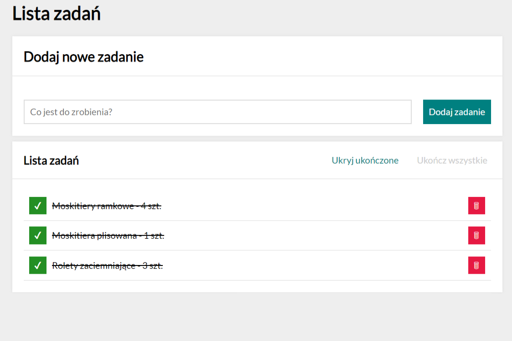

# Task-list

## Demo
[Website project](https://mbigos86.github.io/task-list/).

## Task-list info

It allows adding and removing tasks from the list. 
The task can be checked, deleted, hide or show completed or done all tasks with one button.

 The technologies used are: 
 - HTML;
 - CSS;
 - BEM;
 - JavaScript.
